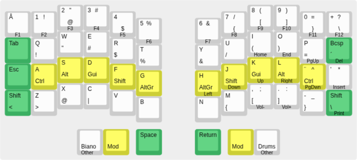
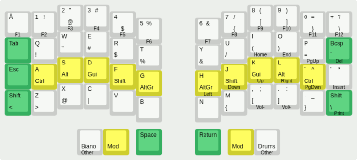

**Note: a clanker was very involved in the firmware changes and build automation.**

**Thanks to [Squalius Cephalus](https://github.com/Squalius-cephalus/silakka54)** for designing a cheap ergo-keyboard in the first place.

# ripuli54
A keymap for Silakka54 intended as the starting point (first and/or final layout) for someone coming from standard finnish/swedish keyboards.

## The Layout
The majority of relevant characters, symbols, and modifiers are available in familiar positions at least in the relative sense.
The goal is that you can pretty much start typing like you used to. A lot of personal bias there ofc.



### Base Layer: Natural Language

For natural language production mainly in english, finnish, and swedish, prioritized in that order. You're mostly talking to a clanker anyway aren't you.

Only two major things to learn:

1) Because english is prioritized 'ä' and 'ö' come from the dead key right to 'L'. 'Å' gets the hardest to reach position since it's rare in the prioritization.
2) Right thumb for Return.

### Modifier Layers

The most important ergonomic change. A regular keyboard itself would be 80% better with just this change: sticky mods.

>NOTE: _Regular home-row-mods SUCK and most "minimal keyboard" solutions depend on them. That is "hold for mod, tap gives the regular character." They break as soon as you try to do things fast and you end up fighting with timings etc. Don't take this rabbit hole. You've been warned._

#### Single Modifiers 
Here the modifiers and the mod-layers themselves are one-shots. I.e. they activate on single taps, allowing roll typing.

That is, just tapping either thumb key for mods keeps the mod layer active until you either:
1) Press a modifier
2) Press a transparent key (applies mod, if any)
3) Press Escape (an explicit mod cancel)

The benefits are:
1) Not getting accidental mod behavior when typing fast, like with regular home-row-mods.
2) Being able to roll type symbols and single-mod shortcuts.

E.g. single mod shortcuts like Ctrl-C (paste) or GUI-number (change desktop) don't require awkward finger-yoga, just three consequtive taps that can even be on separate hands:
- tap mod-layer-key
- tap mod
- tap final key


>_Example tap-pattern to roll Ctrl-C, both hands or only left handed_

Same goes for the worst way to get certain symbols that is **AltGr**, cursed be it's name. E.g. typing '{' on a regular keyboard is an offense to the wrist. Here you just activate the mod with two taps, then tap '7'.

#### Multiple Modifiers

Multi-mod shortcuts can't be rolled completely, but as long as the mod-layer key is held they will stack.

So Ctrl-Shift-V looks like:
- hold mod-layer key
- activate the mods you want
- let go and press the final key.


>_Dual and single hand examples of Ctrl-Shift-V_

#### Sending a Lone Modifier

A double tap on a mod while the mod-layer key's held sends just the mod alone.

This is useful for e.g. opening the Windows Start Menu: hold mod-key, double-tap the GUI. Or to hold Ctrl while scrolling with the mouse wheel for zoom: hold mod-key, double tap Ctrl. 

## How to Build

### Linux
Requirements: `git`, `python3`, the [qmk CLI](https://docs.qmk.fm/cli)
(`pip install qmk`), and an ARM GCC toolchain (`arm-none-eabi-gcc` plus newlib;
e.g. `gcc-arm-none-eabi` + `libnewlib-arm-none-eabi` on Debian/Ubuntu).

```bash
./build.sh
```

This fetches the pinned vial-qmk-silakka54 commit and its submodules into
`build/` (first run only), symlinks the keymap into it, and produces
`build/vial-qmk-silakka54/.build/silakka54_ripuli54.uf2`.

So the build script not only builds, but sets up a dev-environment. Just edit the files under `keyboards/` and rerun it and reflash.

### Windows (WSL2) **UNTESTED**
`build.sh` needs a Linux shell, so use WSL2 (from an admin PowerShell:
`wsl --install -d Ubuntu`, then reboot). Inside Ubuntu, install the
requirements:

```bash
sudo apt update && sudo apt install -y git pipx gcc-arm-none-eabi libnewlib-arm-none-eabi
pipx install qmk && pipx ensurepath
```

Clone into the Linux home directory (e.g. `~/ripuli54`), not under `/mnt/c/`
since builds on the Windows drive are very slow, and symlinks/permissions
misbehave there. Then run `./build.sh` as above.

## How to Flash

**NOTE: before flashing backup your Vial-config if you have one**

The build outputs `build/vial-qmk-silakka54/.build/silakka54_ripuli54.uf2` which is the file you flash with.

Both halves have to be flashed separately, but it's a simple copy-paste procedure:
1) Disconnect the keyboard
2) Reconnect **the left half** while holding the BOOT-button on the RP2040-Zero
3) You should get a mount-point like /media/<user>/RPI-RP2/
4) Copy the .uf2 file there and dismount
5) Repeat for the right half
6) Reconnect the left half normally

After flashing a structural change (a layer added/removed, or anything that
shifts layer indices), press `EE_CLR` once on the keyboard. It's not on the default layers but can be easily added in Vial; with
the saved `.vil` loaded, the combo Esc + Tab + LShift + Backspace does the
same. Vial's dynamic
keymap lives in EEPROM and needs to resync with the new compiled layout.
`EE_CLR` restores the firmware's default layers (`keymap_vil.h`), but not
combos, tap dances or key overrides: load the `.vil` in Vial to get those back.

## Changing the Layout

Edit in Vial and either save the layout over `vial/ripuli54.vil` or create your own backup. The firmware's
default layers (`keymap_vil.h`, what `EE_CLR` restores) only change when you
choose to update them from the `.vil`:

```bash
./util/vil2keymap.py
```

Then rerun `./build.sh`. The script needs `build/` to exist, so run
`./build.sh` once after cloning.

## Editor setup (clangd)

`build.sh` also writes a `compile_commands.json` at the repo root (plus a
`.clangd` that strips ARM-only flags), so any clangd-based editor gets
completion and diagnostics for the keymap sources against the real QMK
headers. Run `./build.sh` once after cloning, then open the repo;
go-to-definition into QMK sources works too.

The database is only regenerated when `rules.mk`, `config.h` or the QMK pin
change, so editing the `.c` files doesn't slow the build down.

## What's here

```
keyboards/silakka54/keymaps/ripuli54/
    keymap.c    -- process_record_user() chaining the modules
    keymap_vil.h -- default layers, generated from vial/ripuli54.vil
                   (see Changing the Layout)
    osm.c       -- one-shot mods: stack when chorded, Esc cancels them
    drums.c     -- drum kit: hit/hold counting and cymbal choke (MIDI)
    piano.c     -- piano scale-degree engine, root/scale pickers (MIDI)
    custom_keycodes.h -- DRM_*/SC_* keycodes (MIDI)
    config.h    -- Vial UID/unlock combo, dynamic layer count, MIDI_ADVANCED
    rules.mk    -- feature flags (MIDI_ENABLE, VIAL_ENABLE), sources, debounce
    vial.json   -- Vial GUI definition: physical layout (from the stock
                   silakka54 vial keymap), drum keycode names, MIDI tab
```

### Without MIDI
Set `MIDI_ENABLE = no` in `rules.mk` to build just the typing layers: the
drum/piano modules and layers are left out, and Vial gets 9 layers instead
of 12.

### MIDI in Vial
The drums can be bound by name from Vial's **User** tab, and QMK's own MIDI
keycodes (`MI_*`, e.g. All Notes Off) are in the **MIDI** tab. The piano
and scale/root keys show as hex on purpose: they only make sense in their
fixed grid positions.

When changing the custom keycodes:
- The drum enum in `custom_keycodes.h` and `customKeycodes` in `vial.json`
  must stay in the same order -- Vial names keycodes by position.
- Renumbering any custom keycode changes the values saved in
  `vial/ripuli54.vil` and `keymap_vil.h`; remap both, or the MIDI layers
  will play the wrong keys.
